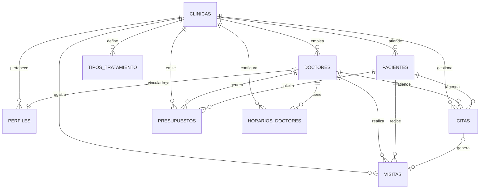

# LUMEN CRM — Documentación Técnica Completa

> **Versión:** 1.0 — Primera Release Final  
> **Repositorio:** [crm_clinic_lumen](https://github.com/lmn-bi/crm_clinic_lumen)  
> **Equipo:** Lumen BI  
> **Última actualización:** 27 de mayo de 2026

---

## 1. Visión General

**LUMEN CRM** es un sistema de gestión integral para clínicas médicas, construido como una **Single Page Application (SPA)** moderna y en tiempo real. Permite administrar pacientes, doctores, citas, presupuestos y configuración de la clínica desde una interfaz unificada, con soporte completo para **modo oscuro**, **drag & drop** en el calendario, y **actualizaciones en tiempo real** sin necesidad de recargar la página.

El sistema está diseñado bajo una arquitectura **multi-tenant**: cada clínica opera de forma aislada con sus propios datos, doctores y pacientes, separados a nivel de base de datos mediante Row Level Security (RLS).

### Características Principales

| Módulo | Funcionalidad |
|---|---|
| **Dashboard** | Métricas en tiempo real, gráficos de tendencias, distribución por origen y estado de citas |
| **Calendario** | Vista semanal con drag & drop, validación de horarios, zonas no disponibles, citas en tiempo real |
| **Pacientes** | CRUD completo, ficha clínica detallada, historial de visitas, búsqueda en tiempo real |
| **Doctores** | Gestión de doctores, horarios laborales por día, colores de calendario, creación con credenciales |
| **Presupuestos** | Módulo preparado para gestión de presupuestos por paciente |
| **Configuración** | Nombre de clínica, horarios del calendario, tratamientos, activación de agente de voz |
| **Autenticación** | Login con email/password, recuperación de contraseña, roles admin/doctor |
| **Modo Oscuro** | Toggle global con persistencia en localStorage |

---

## 2. Stack Tecnológico

### Frontend

| Tecnología | Versión | Propósito |
|---|---|---|
| **React** | 19.2 | Librería de UI, componentes funcionales con hooks |
| **Vite** | 8.0 | Bundler y servidor de desarrollo ultrarrápido |
| **React Router DOM** | 7.15 | Enrutamiento SPA con rutas protegidas por rol |
| **Tailwind CSS** | 4.3 | Framework CSS utility-first con soporte nativo de dark mode |
| **Lucide React** | 1.16 | Iconografía moderna (SVG) |
| **Recharts** | 3.8 | Gráficos interactivos para el dashboard |
| **date-fns / date-fns-tz** | 4.1 / 3.2 | Manipulación de fechas y zonas horarias (Europe/Madrid) |
| **jsPDF + html2canvas-pro** | 4.2 / 2.0 | Generación de PDFs desde el navegador |
| **xlsx** | 0.18 | Exportación a Excel |

### Backend (BaaS)

| Tecnología | Propósito |
|---|---|
| **Supabase** | Base de datos PostgreSQL, autenticación, APIs REST auto-generadas, Realtime |
| **Supabase Auth** | Autenticación con JWT, gestión de sesiones |
| **Supabase Realtime** | Suscripciones WebSocket a cambios en tablas (INSERT/UPDATE/DELETE) |
| **Supabase Edge Functions** | Funciones serverless en Deno para operaciones privilegiadas |
| **Row Level Security (RLS)** | Aislamiento de datos por clínica a nivel de base de datos |

### Infraestructura

| Herramienta | Propósito |
|---|---|
| **GitHub** | Control de versiones y repositorio remoto |
| **Supabase Cloud** | Hosting de base de datos, auth y edge functions |
| **Node.js** | Entorno de ejecución para herramientas de desarrollo |

---

## 3. Arquitectura del Sistema

```
┌─────────────────────────────────────────────────────────┐
│                    NAVEGADOR (SPA)                       │
│  ┌──────────┐ ┌──────────┐ ┌──────────┐ ┌────────────┐  │
│  │Dashboard │ │Calendario│ │Pacientes │ │Configuración│ │
│  └────┬─────┘ └────┬─────┘ └────┬─────┘ └─────┬──────┘  │
│       │             │            │              │         │
│  ┌────┴─────────────┴────────────┴──────────────┴──────┐ │
│  │              AuthContext + ThemeContext              │ │
│  │         (Estado global: usuario, perfil, tema)      │ │
│  └────────────────────────┬────────────────────────────┘ │
│                           │                              │
│  ┌────────────────────────┴────────────────────────────┐ │
│  │          supabaseClient.js (@supabase/supabase-js)  │ │
│  └────────────────────────┬────────────────────────────┘ │
└───────────────────────────┼──────────────────────────────┘
                            │ HTTPS + WSS
                            ▼
┌───────────────────────────────────────────────────────────┐
│                    SUPABASE CLOUD                         │
│                                                           │
│  ┌──────────────┐  ┌──────────────┐  ┌─────────────────┐ │
│  │  Auth (JWT)   │  │  Realtime    │  │ Edge Functions  │ │
│  │              │  │  (WebSocket) │  │ (Deno Runtime)  │ │
│  └──────┬───────┘  └──────┬───────┘  └────────┬────────┘ │
│         │                 │                    │          │
│  ┌──────┴─────────────────┴────────────────────┴────────┐ │
│  │                PostgreSQL Database                    │ │
│  │  ┌─────────┐ ┌─────────┐ ┌──────────┐ ┌───────────┐ │ │
│  │  │clinicas │ │doctores │ │pacientes │ │   citas   │ │ │
│  │  └─────────┘ └─────────┘ └──────────┘ └───────────┘ │ │
│  │  ┌─────────┐ ┌──────────────────┐ ┌───────────────┐ │ │
│  │  │perfiles │ │tipos_tratamiento │ │ presupuestos  │ │ │
│  │  └─────────┘ └──────────────────┘ └───────────────┘ │ │
│  │  ┌──────────────────┐ ┌───────────┐                 │ │
│  │  │horarios_doctores │ │  visitas  │   + RLS Policies│ │
│  │  └──────────────────┘ └───────────┘                 │ │
│  └──────────────────────────────────────────────────────┘ │
└───────────────────────────────────────────────────────────┘
```

### Flujo de Datos

1. **Autenticación:** El usuario inicia sesión → Supabase Auth genera un JWT → el frontend lo almacena automáticamente y lo adjunta a cada petición.
2. **Lectura de datos:** El cliente Supabase genera queries REST a PostgreSQL. Los RLS policies filtran los datos según el `clinica_id` del usuario autenticado.
3. **Tiempo real:** El hook `useCitasRealtime` abre un canal WebSocket a Supabase Realtime. Cualquier INSERT, UPDATE o DELETE en la tabla `citas` se refleja instantáneamente en todos los clientes conectados.
4. **Operaciones privilegiadas:** La creación de nuevos usuarios (doctores) requiere permisos de `service_role`. El frontend invoca la Edge Function `create-user`, que verifica que el solicitante es admin y luego usa la Service Role Key para crear el usuario en `auth.users`.

---

## 4. Estructura del Proyecto

```
crm-clinica/
├── public/                          # Assets estáticos
├── src/
│   ├── App.jsx                      # Router principal, rutas protegidas por rol
│   ├── main.jsx                     # Entry point, providers (Auth, Theme, Router)
│   ├── index.css                    # Estilos base de Tailwind
│   ├── App.css                      # Estilos CSS personalizados y animaciones
│   │
│   ├── components/
│   │   ├── layout/
│   │   │   ├── MainLayout.jsx       # Layout con sidebar + header + outlet
│   │   │   ├── Sidebar.jsx          # Navegación lateral filtrada por rol
│   │   │   └── Header.jsx           # Barra superior con info de usuario
│   │   │
│   │   ├── calendario/
│   │   │   ├── CalendarioMain.jsx   # Vista semanal con grid, drag & drop
│   │   │   ├── CitaFormModal.jsx    # Modal para crear/editar citas
│   │   │   └── CitaDetailModal.jsx  # Modal detalle de cita con cambio de estado
│   │   │
│   │   ├── pacientes/
│   │   │   ├── PacientesTable.jsx   # Tabla de pacientes con búsqueda
│   │   │   ├── PacienteFormModal.jsx # Modal para crear/editar pacientes
│   │   │   ├── PacienteFichaPanel.jsx # Ficha clínica detallada del paciente
│   │   │   └── VisitaFormModal.jsx  # Modal para registrar visitas clínicas
│   │   │
│   │   ├── doctores/
│   │   │   ├── DoctoresTable.jsx    # Tabla de doctores
│   │   │   ├── DoctorFormModal.jsx  # Modal para editar doctor + horarios
│   │   │   └── DoctorAgendaPanel.jsx # Panel lateral de agenda del doctor
│   │   │
│   │   └── dashboard/
│   │       ├── DashboardHeader.jsx  # KPIs y filtros de período
│   │       ├── MultiSelectDropdown.jsx # Componente dropdown multi-select
│   │       ├── nivel1/              # Gráficos principales del dashboard
│   │       └── nivel2/              # Gráficos secundarios y tablas detalladas
│   │
│   ├── pages/
│   │   ├── LoginPage.jsx            # Página de inicio de sesión
│   │   ├── ResetPasswordPage.jsx    # Solicitar reseteo de contraseña
│   │   ├── UpdatePasswordPage.jsx   # Actualizar contraseña desde email
│   │   ├── DashboardPage.jsx        # Dashboard con métricas y gráficos
│   │   ├── CalendarioPage.jsx       # Wrapper del calendario
│   │   ├── PacientesPage.jsx        # Gestión de pacientes
│   │   ├── DoctoresPage.jsx         # Gestión de doctores
│   │   ├── PresupuestosPage.jsx     # Gestión de presupuestos (placeholder)
│   │   └── SettingsPage.jsx         # Configuración general de la clínica
│   │
│   ├── context/
│   │   ├── AuthContext.jsx          # Provider de autenticación y perfil
│   │   └── ThemeContext.jsx         # Provider de modo oscuro/claro
│   │
│   ├── hooks/
│   │   ├── useCitasRealtime.js      # Hook con suscripción Realtime a citas
│   │   └── useDashboardData.js      # Hook para métricas del dashboard
│   │
│   ├── utils/
│   │   └── horarioUtils.js          # Validación de horarios y zonas no disponibles
│   │
│   ├── lib/
│   │   └── supabaseClient.js        # Instancia singleton del cliente Supabase
│   │
│   └── config/
│       └── dashboardConfig.js       # Configuración de colores y opciones del dashboard
│
├── supabase/
│   ├── config.toml                  # Configuración local del proyecto Supabase
│   ├── migrations/                  # Migraciones SQL del schema
│   └── functions/
│       └── create-user/
│           └── index.ts             # Edge Function para creación segura de usuarios
│
├── package.json
├── tailwind.config.js
├── vite.config.js
└── DOCUMENTACION.md                 # Este archivo
```

---

## 5. Base de Datos — Schema Completo

La base de datos es PostgreSQL gestionada por Supabase. Todas las tablas usan UUID como clave primaria y tienen `clinica_id` como clave foránea para el aislamiento multi-tenant.

### Diagrama Entidad-Relación



### Tabla: `clinicas`

Entidad raíz del sistema multi-tenant. Cada clínica es un entorno aislado.

| Columna | Tipo | Nullable | Default | Descripción |
|---|---|---|---|---|
| `id` | uuid | NO | `gen_random_uuid()` | PK |
| `nombre` | text | NO | — | Nombre visible de la clínica |
| `direccion` | text | SÍ | — | Dirección física |
| `created_at` | timestamptz | SÍ | `now()` | Fecha de creación |
| `hora_apertura` | time | SÍ | `08:00:00` | Hora de inicio del calendario |
| `hora_cierre` | time | SÍ | `21:00:00` | Hora de fin del calendario |
| `asistente_voz_activo` | boolean | SÍ | `false` | Activa/desactiva el agente de voz AI |
| `duracion_cita_defecto` | integer | SÍ | `30` | Duración por defecto de las citas (minutos) |

### Tabla: `perfiles`

Vincula un usuario de `auth.users` (Supabase Auth) con su rol y clínica. Es la tabla que el `AuthContext` consulta al iniciar sesión.

| Columna | Tipo | Nullable | Default | Descripción |
|---|---|---|---|---|
| `id` | uuid | NO | — | PK, coincide con `auth.users.id` |
| `rol` | text | NO | — | `'admin'` o `'doctor'` |
| `doctor_id` | uuid | SÍ | — | FK → `doctores.id` (solo si rol es doctor) |
| `nombre` | text | SÍ | — | Nombre del perfil |
| `created_at` | timestamptz | SÍ | `now()` | Fecha de creación |
| `clinica_id` | uuid | SÍ | — | FK → `clinicas.id` |

### Tabla: `doctores`

Información profesional y configuración visual de cada médico.

| Columna | Tipo | Nullable | Default | Descripción |
|---|---|---|---|---|
| `id` | uuid | NO | `uuid_generate_v4()` | PK |
| `nombre` | text | NO | — | Nombre |
| `apellidos` | text | SÍ | — | Apellidos |
| `especialidad` | text | NO | — | Especialidad médica |
| `email` | text | SÍ | — | Email del doctor |
| `activo` | boolean | SÍ | `true` | Si aparece en filtros y calendario |
| `created_at` | timestamptz | SÍ | `now()` | Fecha de creación |
| `color_calendario` | text | SÍ | `'#3B82F6'` | Color hexadecimal para sus citas |
| `horario` | jsonb | SÍ | `'[]'` | Array de tramos laborales (ver formato abajo) |
| `num_colegiado` | text | SÍ | `'999999'` | Número de colegiado |
| `telefono` | text | SÍ | — | Teléfono |
| `clinica_id` | uuid | SÍ | — | FK → `clinicas.id` |

**Formato del campo `horario` (JSONB):**
```json
[
  { "dia": "Lunes",    "inicio": "09:00", "fin": "13:00" },
  { "dia": "Lunes",    "inicio": "15:00", "fin": "19:00" },
  { "dia": "Martes",   "inicio": "08:00", "fin": "14:00" },
  { "dia": "Miércoles","inicio": "09:00", "fin": "13:00" }
]
```
Un doctor puede tener **múltiples tramos por día** (ej: mañana y tarde) o **no trabajar ciertos días** (simplemente no se incluyen en el array).

### Tabla: `pacientes`

| Columna | Tipo | Nullable | Default | Descripción |
|---|---|---|---|---|
| `id` | uuid | NO | `uuid_generate_v4()` | PK |
| `nombre` | text | NO | — | Nombre |
| `apellidos` | text | NO | — | Apellidos |
| `telefono` | text | NO | — | Teléfono de contacto |
| `email` | text | SÍ | — | Email |
| `fecha_nacimiento` | date | SÍ | — | Fecha de nacimiento |
| `historial_notas` | text | SÍ | — | Notas generales del historial |
| `alergias` | text | SÍ | — | Alergias conocidas |
| `created_at` | timestamptz | SÍ | `now()` | Fecha de registro |
| `updated_at` | timestamptz | SÍ | `now()` | Última actualización |
| `doc_identidad` | text | SÍ | — | DNI / NIE / Pasaporte |
| `clinica_id` | uuid | SÍ | — | FK → `clinicas.id` |

### Tabla: `citas`

Entidad central del calendario. Cada cita vincula un paciente con un doctor en un rango horario.

| Columna | Tipo | Nullable | Default | Descripción |
|---|---|---|---|---|
| `id` | uuid | NO | `uuid_generate_v4()` | PK |
| `paciente_id` | uuid | NO | — | FK → `pacientes.id` |
| `doctor_id` | uuid | NO | — | FK → `doctores.id` |
| `inicio` | timestamptz | NO | — | Fecha/hora de inicio |
| `fin` | timestamptz | NO | — | Fecha/hora de fin |
| `tipo_tratamiento` | text | SÍ | — | Tipo de tratamiento textual |
| `duracion_min` | integer | NO | `30` | Duración en minutos |
| `estado` | text | NO | `'pendiente'` | Estado de la cita (ver máquina de estados) |
| `origen` | text | SÍ | `'web'` | Origen: `'web'` o `'telefono'` (agente de voz) |
| `notas` | text | SÍ | — | Notas de la cita |
| `created_at` | timestamptz | SÍ | `now()` | Fecha de creación |
| `presupuesto` | numeric | SÍ | — | Monto del presupuesto asociado |
| `costo_tratamiento` | numeric | SÍ | — | Costo final del tratamiento |
| `clinica_id` | uuid | SÍ | — | FK → `clinicas.id` |

**Máquina de estados de la cita:**
```
pendiente → confirmada → completada
    │            │
    └──→ cancelada ←──┘
         no_show ←────┘
```

### Tabla: `tipos_tratamiento`

Catálogo de tratamientos configurables por la clínica.

| Columna | Tipo | Nullable | Default | Descripción |
|---|---|---|---|---|
| `id` | uuid | NO | `uuid_generate_v4()` | PK |
| `nombre` | text | NO | — | Nombre del tratamiento |
| `duracion_min` | integer | NO | — | Duración en minutos |
| `activo` | boolean | SÍ | `true` | Si aparece en los formularios |
| `clinica_id` | uuid | SÍ | — | FK → `clinicas.id` |

### Tabla: `visitas`

Registro clínico de cada visita realizada a un paciente.

| Columna | Tipo | Nullable | Default | Descripción |
|---|---|---|---|---|
| `id` | uuid | NO | `uuid_generate_v4()` | PK |
| `paciente_id` | uuid | NO | — | FK → `pacientes.id` |
| `doctor_id` | uuid | NO | — | FK → `doctores.id` |
| `cita_id` | uuid | SÍ | — | FK → `citas.id` (opcional) |
| `fecha` | date | NO | `CURRENT_DATE` | Fecha de la visita |
| `tratamiento` | text | NO | — | Tratamiento realizado |
| `observaciones` | text | SÍ | — | Observaciones clínicas |
| `proximos_pasos` | text | SÍ | — | Plan de seguimiento |
| `archivos_url` | text[] | SÍ | `'{}'` | URLs de archivos adjuntos |
| `created_at` | timestamptz | SÍ | `now()` | Fecha de creación |
| `updated_at` | timestamptz | SÍ | `now()` | Última actualización |
| `clinica_id` | uuid | SÍ | — | FK → `clinicas.id` |

### Tabla: `horarios_doctores`

Tabla auxiliar para horarios estructurados (disponible pero el sistema prioriza el campo JSONB `doctores.horario`).

| Columna | Tipo | Nullable | Default | Descripción |
|---|---|---|---|---|
| `id` | uuid | NO | `uuid_generate_v4()` | PK |
| `doctor_id` | uuid | NO | — | FK → `doctores.id` |
| `dia_semana` | integer | NO | — | 0=Domingo, 1=Lunes, ..., 6=Sábado |
| `hora_inicio` | time | NO | — | Hora de inicio del tramo |
| `hora_fin` | time | NO | — | Hora de fin del tramo |
| `activo` | boolean | SÍ | `true` | Si el tramo está activo |
| `clinica_id` | uuid | SÍ | — | FK → `clinicas.id` |

### Tabla: `presupuestos`

Presupuestos generados para pacientes.

| Columna | Tipo | Nullable | Default | Descripción |
|---|---|---|---|---|
| `id` | uuid | NO | `uuid_generate_v4()` | PK |
| `paciente_id` | uuid | NO | — | FK → `pacientes.id` |
| `doctor_id` | uuid | SÍ | — | FK → `doctores.id` |
| `concepto` | text | NO | — | Descripción del concepto |
| `monto_total` | numeric | NO | — | Monto total del presupuesto |
| `estado` | text | NO | `'borrador'` | Estado del presupuesto |
| `pdf_url` | text | SÍ | — | URL del PDF generado |
| `notas` | text | SÍ | — | Notas adicionales |
| `created_at` | timestamptz | SÍ | `now()` | Fecha de creación |
| `updated_at` | timestamptz | SÍ | `now()` | Última actualización |
| `clinica_id` | uuid | SÍ | — | FK → `clinicas.id` |

---

## 6. Seguridad — Row Level Security (RLS)

Todas las tablas tienen RLS habilitado. Las políticas garantizan que un usuario solo puede acceder a datos de su propia clínica:

```sql
-- Ejemplo de política SELECT para la tabla citas:
CREATE POLICY "Usuarios ven citas de su clinica"
ON public.citas FOR SELECT
USING (
  EXISTS (
    SELECT 1 FROM perfiles
    WHERE perfiles.id = auth.uid()
      AND perfiles.clinica_id = citas.clinica_id
  )
);
```

**Patrón general de las políticas:**
- **SELECT:** El usuario puede ver registros donde `registro.clinica_id` coincide con su `perfiles.clinica_id`.
- **INSERT:** El usuario puede insertar registros donde el `clinica_id` del nuevo registro coincide con su clínica.
- **UPDATE:** Los administradores pueden actualizar registros de su clínica. Los doctores pueden actualizar sus propias citas.
- **DELETE:** Solo los administradores pueden eliminar registros de su clínica.

### Edge Function: `create-user`

La creación de nuevos usuarios requiere la `SERVICE_ROLE_KEY` (super admin). Esta operación nunca se expone al frontend. En su lugar, el admin invoca la Edge Function que:

1. Verifica que el solicitante tiene `rol = 'admin'` en la tabla `perfiles`.
2. Extrae el `clinica_id` del admin para asignarlo al nuevo usuario.
3. Crea el usuario en `auth.users` usando el Admin API.
4. Si el rol es `doctor`, crea un registro en la tabla `doctores`.
5. Crea el registro en `perfiles` vinculando todo.

**Runtime:** Deno (Supabase Edge Functions)  
**Ubicación:** `supabase/functions/create-user/index.ts`

---

## 7. Sistema de Autenticación

### Flujo de Login

```
┌─────────┐    email/password    ┌──────────────┐    JWT Token    ┌──────────────┐
│  Login   │ ──────────────────→ │ Supabase Auth │ ─────────────→ │ AuthContext   │
│  Page    │                     │   (auth.users) │               │ fetchProfile()│
└─────────┘                     └──────────────┘               └──────┬───────┘
                                                                      │
                                                                      ▼
                                                              ┌──────────────┐
                                                              │ tabla perfiles│
                                                              │ rol, clinica  │
                                                              │ doctor_id     │
                                                              └──────────────┘
```

### AuthContext

El `AuthContext` expone:

| Propiedad | Tipo | Descripción |
|---|---|---|
| `user` | object \| null | Usuario de Supabase Auth (id, email, etc.) |
| `perfil` | object \| null | Datos de la tabla `perfiles` + join a `clinicas` |
| `login(email, pwd)` | function | Inicia sesión |
| `logout()` | function | Cierra sesión |
| `refreshProfile()` | function | Recarga el perfil desde la DB (tras cambios en Settings) |
| `loading` | boolean | Estado de carga inicial |

### Roles y Permisos

| Funcionalidad | Admin | Doctor |
|---|:---:|:---:|
| Dashboard | ✅ | ❌ |
| Calendario (todos los doctores) | ✅ | ❌ |
| Calendario (solo su agenda) | — | ✅ |
| Pacientes (CRUD) | ✅ | ✅ |
| Doctores (CRUD) | ✅ | ❌ |
| Presupuestos | ✅ | ❌ |
| Configuración | ✅ | ❌ |
| Crear nuevos usuarios | ✅ | ❌ |

---

## 8. Módulos en Detalle

### 8.1 Calendario (`CalendarioMain.jsx`)

El calendario es el componente más complejo del sistema. Se renderiza como un grid CSS de 7 columnas (Lunes-Domingo) donde cada hora ocupa 120px de alto (cada slot de 15 min = 30px).

**Funcionalidades:**
- **Vista semanal** con navegación (Hoy, semana anterior, siguiente).
- **Drag & Drop nativo** de citas entre slots y días. Usa `dataTransfer` del API de HTML5.
- **Validación de solapamiento:** Antes de mover una cita, verifica que no haya conflictos con otras citas del mismo doctor.
- **Validación de horario laboral:** Advierte si la cita cae fuera del horario configurado del doctor (pero permite override con confirmación).
- **Zonas no disponibles:** Overlay gris semitransparente sobre las horas donde el doctor no trabaja.
- **Línea roja "ahora":** Indicador visual de la hora actual con un punto rojo.
- **Filtro por doctor:** Dropdown multi-select para ver uno, varios o todos los doctores.
- **Tiempo real:** Usa el hook `useCitasRealtime` para reflejar cambios instantáneamente.
- **Altura dinámica:** Si hay citas fuera del horario de cierre, el calendario se extiende automáticamente.

**Escala visual:**
```
1 hora  = 120px
15 min  = 30px
1 min   = 2px
```

### 8.2 Citas en Tiempo Real (`useCitasRealtime.js`)

Este hook custom implementa la sincronización bidireccional:

1. **Fetch inicial:** Carga las citas del rango de la semana actual con JOINs a `pacientes` y `doctores`.
2. **Suscripción Realtime:** Abre un canal WebSocket filtrado por `clinica_id`:
   - **INSERT:** Verifica que la nueva cita cae dentro del rango visible y los filtros activos antes de agregarla al state. Previene duplicados por race conditions.
   - **UPDATE:** Actualiza la cita in-place o la remueve si fue cancelada o movida fuera del rango.
   - **DELETE:** Remueve la cita del state local.
3. **Refetch manual:** Expone una función `refetch()` para forzar recarga completa (usado al cerrar modales).

### 8.3 Dashboard (`DashboardPage.jsx`)

El dashboard ofrece métricas ejecutivas con filtros de período (Hoy, Semana, Mes, Trimestre, Custom):

**KPIs:**
- Total de citas en el período
- Pacientes nuevos registrados
- Tasa de no-show (%)
- Ingresos estimados

**Gráficos (Recharts):**
- Distribución de citas por estado (pie chart)
- Tendencia de citas por día/semana (line chart)
- Distribución por origen: Web vs. Teléfono (bar chart)
- Tabla de próximas citas del día

### 8.4 Validación de Horarios (`horarioUtils.js`)

Módulo utilitario con tres funciones:

| Función | Propósito |
|---|---|
| `validarHorarioDoctor(horario, citaInicio, citaFin)` | Verifica si una cita cae dentro de algún tramo laboral del doctor |
| `fetchHorarioDoctor(doctorId)` | Obtiene el campo JSONB `horario` de un doctor |
| `calcularZonasNoDisponibles(horario, diaSemana, horaInicio, horaFin, pxPorHora)` | Genera coordenadas `{top, height}` en píxeles para pintar overlays grises en las zonas donde el doctor no trabaja |

---

## 9. Integración con Agente de Voz

El CRM está diseñado para integrarse con un **agente de voz con IA** que puede agendar citas por teléfono. La integración se basa en:

1. **Flag de activación:** `clinicas.asistente_voz_activo` (boolean). El agente de voz debe consultar este campo antes de procesar llamadas.
2. **Campo `origen` en citas:** Las citas creadas por el agente de voz se marcan con `origen = 'telefono'`. Estas citas aparecen en el calendario con un ícono de teléfono (📞).
3. **API:** El agente de voz interactúa directamente con la API REST de Supabase o mediante Edge Functions, usando la Service Role Key o un token de servicio.

**Para consultar si el agente está activo:**
```javascript
const { data } = await supabase
  .from('clinicas')
  .select('asistente_voz_activo')
  .eq('id', CLINICA_ID)
  .single()

if (data.asistente_voz_activo) {
  // Agente activado → procesar llamada
}
```

---

## 10. Modo Oscuro

El sistema de temas usa una clase CSS `dark` en el elemento `<html>`:

- **ThemeContext:** Gestiona el estado del tema y lo persiste en `localStorage`.
- **Tailwind CSS:** Usa el prefijo `dark:` para aplicar estilos condicionales.
- **Toggle:** Botón en el pie del sidebar que alterna entre modos.

```jsx
// Ejemplo de uso en un componente:
<div className="bg-white dark:bg-gray-800 text-gray-900 dark:text-white">
```

---

## 11. Cómo Ejecutar el Proyecto

### Requisitos Previos
- Node.js ≥ 18
- npm ≥ 9
- Un proyecto en Supabase con las tablas y políticas configuradas

### Instalación

```bash
# Clonar el repositorio
git clone https://github.com/lmn-bi/crm_clinic_lumen.git
cd crm_clinic_lumen

# Instalar dependencias
npm install

# Configurar variables de entorno
# Crear archivo .env.local con:
VITE_SUPABASE_URL=https://tu-proyecto.supabase.co
VITE_SUPABASE_ANON_KEY=tu_anon_key_aqui

# Ejecutar en modo desarrollo
npm run dev
```

### Despliegue de la Edge Function

```bash
# Instalar Supabase CLI
npx supabase login

# Vincular con tu proyecto
npx supabase link --project-ref TU_PROJECT_REF

# Desplegar la función
npx supabase functions deploy create-user
```

### Build de Producción

```bash
npm run build    # Genera el bundle en dist/
npm run preview  # Previsualiza el build
```

---

## 12. Variables de Entorno

| Variable | Descripción | Dónde se usa |
|---|---|---|
| `VITE_SUPABASE_URL` | URL del proyecto Supabase | Frontend (`supabaseClient.js`) |
| `VITE_SUPABASE_ANON_KEY` | Clave pública (anon) de Supabase | Frontend (`supabaseClient.js`) |
| `SUPABASE_URL` | URL del proyecto (auto-inyectada en Edge Functions) | Edge Function |
| `SUPABASE_ANON_KEY` | Clave anon (auto-inyectada) | Edge Function |
| `SUPABASE_SERVICE_ROLE_KEY` | Clave de servicio (auto-inyectada, **nunca en frontend**) | Edge Function |

---

## 13. Convenciones de Código

- **Componentes:** React funcional con hooks, nombrados en PascalCase (`CitaFormModal.jsx`).
- **Hooks personalizados:** Prefijo `use` en camelCase (`useCitasRealtime.js`).
- **Utilidades:** camelCase (`horarioUtils.js`).
- **Estilos:** Tailwind utility-first con prefijo `dark:` para modo oscuro.
- **IDs de base de datos:** UUID v4 generados por PostgreSQL.
- **Zona horaria:** `Europe/Madrid` para toda la visualización de fechas.
- **Idioma de la UI:** Español.
- **Idioma del código:** Variables y funciones en español para consistencia con el dominio clínico.

---

*Documento generado para LUMEN CRM v1.0 — Mayo 2026*
